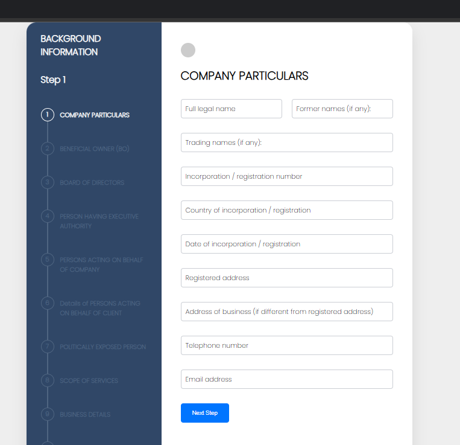

# 🏢 Multi-Step Company Onboarding & KYC Management System

---

## 📌 Overview

This project is a **multi-step company onboarding and KYC (Know Your Customer) management system** developed using core PHP and MySQL.

It is designed to simulate real-world enterprise onboarding workflows where organizations collect structured company data through a guided multi-step process and manage it through an admin panel.

---

## 🚀 Key Highlights

- 🔄 20+ Step Dynamic Form Workflow  
- 📊 Structured Company Data Collection  
- 🛠️ Admin Panel for Data Management  
- 📁 Real-world KYC Modules  
- 📌 Step Progress Navigation System  
- 💡 Practical Enterprise-Level Use Case  

---

## 🧠 System Modules

The system includes multiple structured onboarding steps:

1. Company Particulars  
2. Beneficial Owner (BO)  
3. Board of Directors  
4. Executive Authority  
5. Persons Acting on Behalf  
6. Politically Exposed Person (PEP)  
7. Scope of Services  
8. Business Details  
... and more (20+ steps total)

---

## 👤 User Features

- Multi-step guided form
- Smooth step navigation
- Input validation
- Organized data submission
- Progress tracking

---

## 🛠️ Admin Panel Features

- View submitted company data
- Manage onboarding records
- Structured data handling
- Backend control over system

---

## 🛠️ Tech Stack

| Technology | Purpose |
|----------|--------|
| PHP      | Backend Logic |
| MySQL    | Database |
| HTML/CSS | UI Design |
| JavaScript | Step Handling |

---

## 📂 Project Structure
project-root/
│
├── adminpanel/
│ ├── assets/
│ ├── *.php
│
├── form_pages.php

---

## ⚙️ How to Run

1. Install XAMPP / WAMP  
2. Move project folder to:htdocs/
3. Start Apache & MySQL  
4. Import database into phpMyAdmin  
5. Configure database connection  
6. Open in browser:http://localhost/project-folder

---

## ⚠️ Important Notes

- This project is built using core PHP (non-MVC)
- Designed for learning and demonstration purposes
- Not production-ready (security enhancements needed)

---

## 🚧 Future Improvements

- Convert to MVC architecture  
- Add authentication security  
- File/document upload support  
- API integration  
- UI/UX enhancements  

---

## 👨‍💻 Author

**Saqib Ali**  
Software Engineer | Full Stack Developer  

---

## ⭐ Support

If you find this project useful, consider giving it a ⭐ on GitHub.

